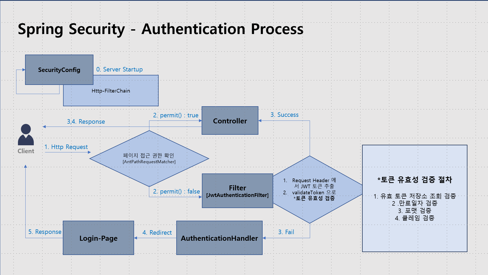
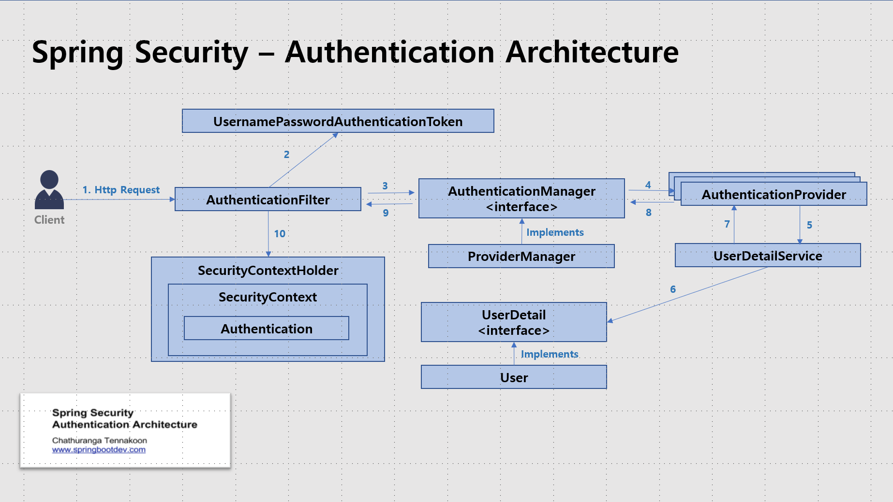
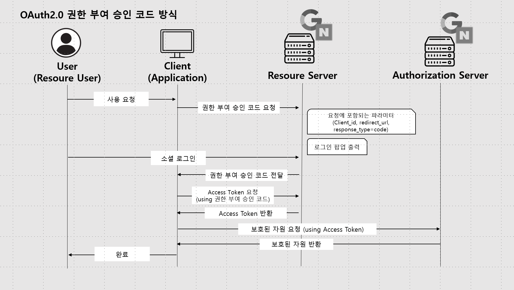

# SecurityReference
이 프로젝트는 `Spring Security 도입 시` **참고자료로 활용하는 것을 목적으로 작업한 결과물**이며, \
    <u>개발의 생산성과 편의성을 증대하고</u>, 프로젝트의 소스와 설정 파일의 규격을 통일하여 <u>코드의 품질과 가독성 향상</u>하기 위한 목표로 추진한다.
## Release
- [v1.3.0](./RELEASENOTE.md#v120-2024-05-30-)
- [v1.2.0](./RELEASENOTE.md#v120-2024-05-13-)
- [v1.1.0](./RELEASENOTE.md#v110-2024-04-24-)
- [v1.0.0](./RELEASENOTE.md#v100-2024-01-30-)

## Architecture in Project
### Spring Security - Process

### JWT - Life Cycle

### Spring Security - Architecture

### OAuth2.0 [간편 회원가입 및 로그인]
#### 1. 권한 부여 승인 코드 방식

#### 2. OAuth2.0 내부 프로세스
.png)

#### 3. OAuth2.0 Client-id/secret 발급 주소
- **Google:** https://console.cloud.google.com/apis/credentials
- **Naver:** https://developers.naver.com/apps/#/register